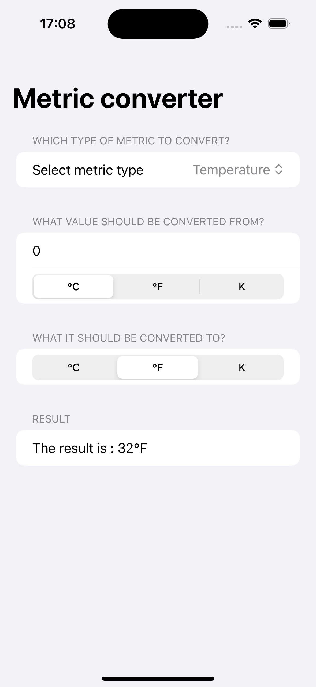

# MetricConverter

iOS app to convert metrics

It's a small application that converts a value from one metric unit to another.

This was developed during the first [hackingwithswift](https://www.hackingwithswift.com/100/swiftui/19) challenge.

  

